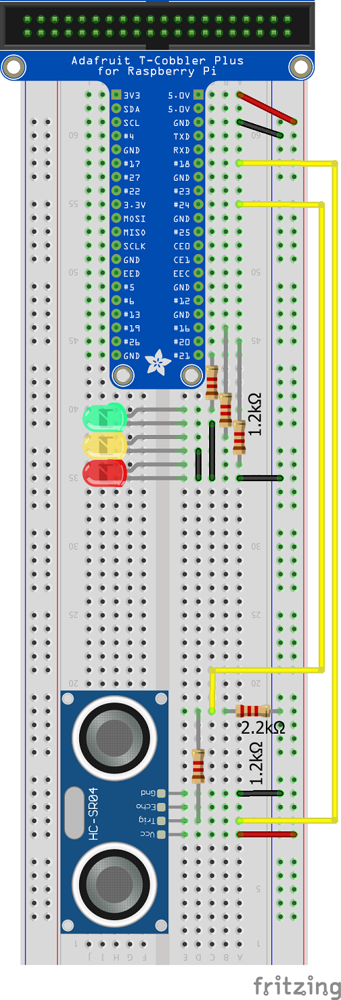

# Distance sensor in python

Simple distance meter build on raspberry pi with 3 LEDs and one distance sensor HC-SR04.

## Operations
The Green LED starts to light if the distance is less than 15cm.  
The Yellow LED starts to light if the distance is less than 10cm.  
The Red LED starts to light if the distance is less than 5cm.  

## Wiring diagram

## Simple prototype
